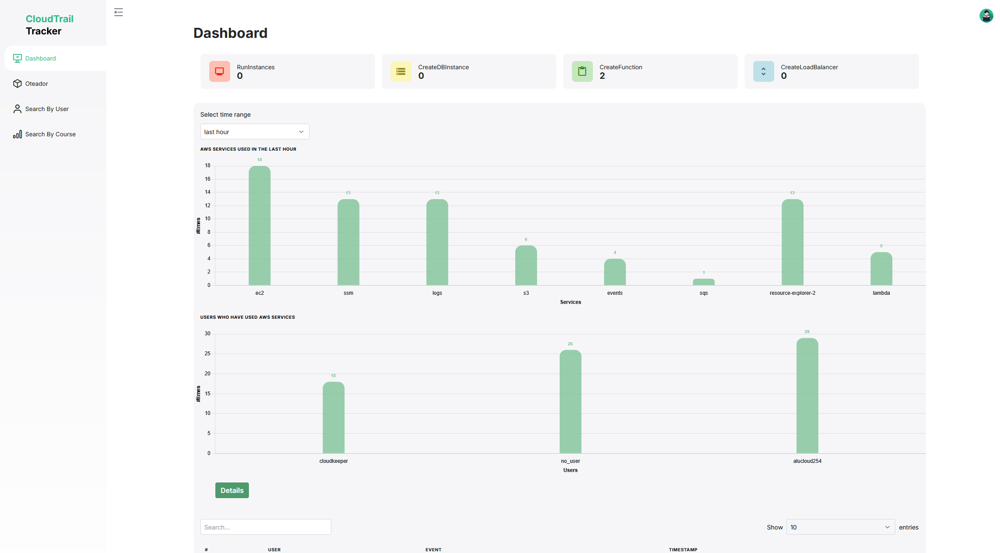

# CloudTrail-Tracker-UI 

CloudTrail-Tracker-UI is a Vue 3 + TypeScript web portal built with Vite. It queries the REST API of [CloudTrail-Tracker](https://github.com/grycap/cloudtrail-tracker) to visually show high-level aggregate information about AWS resource usage by different users based on event data.

## Visual Aspect of the Dashboard
The dashboard depicts an aggregated view of the AWS services usage in a pre-defined time frame: 


It also allows users to know their progress percentage across a set of lab activities. The set of events per lab activities are defined in [evenprac.js](src/data/evenprac.js). This is useful when applying this tool for the academic teaching of Cloud Computing with Amazon Web Services:


Clicking on each bar allows the user to know the missing events per lab activity: 


In addition, there is a panel only for teachers where they can search by a group of students to see metrics such as the progress, students who have yet to start and the academic marks.

An academic publication on the adoption of this tool as a learning dashboard for students is available in:

Naranjo, Diana M., José R. Prieto, Germán Moltó, and Amanda Calatrava. 2019. “A Visual Dashboard to Track Learning Analytics for Educational Cloud Computing.” Sensors 19(13): 2952. https://www.mdpi.com/1424-8220/19/13/2952/htm (July 4, 2019).

## Requirements

* An existing [Cognito User Pool](https://docs.aws.amazon.com/cognito/latest/developerguide/cognito-user-identity-pools.html) to store the  users, created in your AWS account.

* [Yarn](https://yarnpkg.com/) installed.

## Deployment

This is a static web application built with Vue 3, TypeScript and Vite. It compiles to plain static assets and is expected to be deployed in an S3 bucket.

1. Configure Cognito values in `src/amplifyConfig.ts` (see example in src/env_example.js) specifying the corresponding values (obtained from the Cognito User Pool).

    ``` js
    export const amplifyConfig = {
      Auth: {
        Cognito: {
          region: 'us-east-1',
          userPoolId: 'us-east-1_XXXXXXXXX',
          userPoolClientId: 'YYYYYYYYYYYYYYYYYYYYYYYYYY',
          identityPoolId: 'us-east-1:zzzzzzzz-zzzz-zzzz-zzzz-zzzzzzzzzzzz',
        },
      },
    }
    ```
  
2. Configure the API endpoints in `.env`.

3. Start a local server to verify the web application:
    1. Install the dependencies:

        ```sh
        yarn install
        ```

    1. Run the server in localhost

        ```sh
        yarn dev
        ```

    The web application will be available in `http://localhost:5173`

4. Create the static web site by issuing: 
    ```sh
    yarn install
    yarn build:ci
    ```
    The static web site will be available in the `dist` folder.

5. Upload the folder to an [S3 bucket with website configuration](https://docs.aws.amazon.com/AmazonS3/latest/dev/WebsiteHosting.html).

   If you use CloudFront in front of S3, configure custom error responses so `403` and `404` return `/index.html` with HTTP `200`.


## Contributing

Before contributing to this project, you should be familiar with [Amazon Cognito](http://docs.aws.amazon.com/cognito/latest/developerguide/what-is-amazon-cognito.html), [Vue.js](https://vuejs.org/) and [Vite](https://vite.dev/)